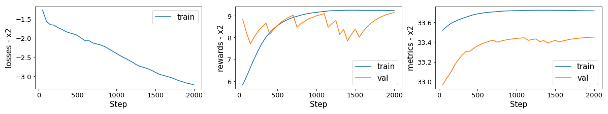
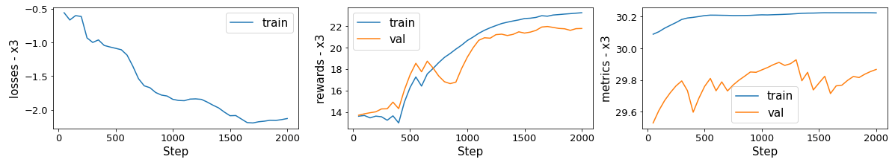
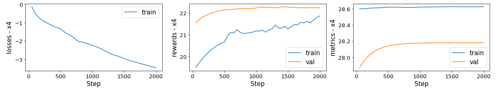
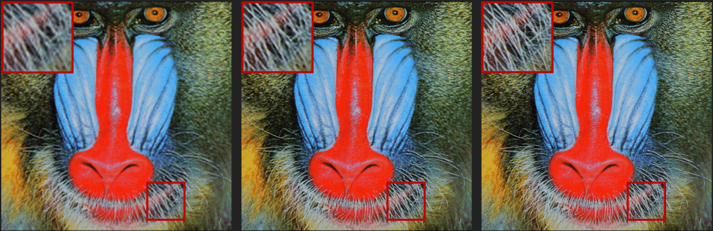
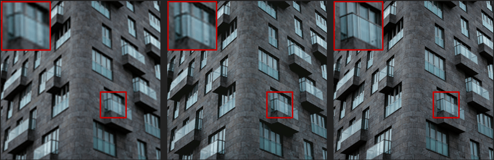

# [Pytorch] Super-Resolution using Multi-Step Reinforcement Learning

Implementation of Super-Resolution model using Reinforcement learning based on **Multi-Step Reinforcement Learning for Single Image Super-Resolution** paper with Pytorch.

## Contents
- [Introduction](#introduction)
- [Train](#train)
- [Test](#test)
- [Demo](#demo)
- [Evaluate](#evaluate)
- [References](#references)

## **Introduction**
This implementation uses [PixelRL](https://arxiv.org/abs/1912.07190) as the core of reinforement learning model, I use my 4 available Super-Resolution models for actions instead of EDSR and ESRGAN as in paper. Because changing the actions are easy so you can use other super-resolution models as your actions. 
I ignore patch-wise agent and keep t_max=5 as in [PixelRL](https://arxiv.org/abs/1912.07190) paper.

<div align="center">

|Index|     Action       |
|:---:|:----------------:|
|  0  |  pixel value -= 1|
|  1  |  do nothing      |
|  2  |  pixel value += 1|
|  3  |  [ESPCN](https://github.com/Nhat-Thanh/ESPCN-Pytorch)    |
|  4  |  [SRCNN](https://github.com/Nhat-Thanh/SRCNN-Pytorch)    |
|  5  |  [VDSR](https://github.com/Nhat-Thanh/VDSR-Pytorch)      |
|  6  |  [FSRCNN](https://github.com/Nhat-Thanh/FSRCNN-Pytorch)  |
    
  <b>The actions.</b>

</div>

## Train
Dataset:
   - Train: T91 + General100 + BSD200
   - Validation: Set14
   - Test: Set5

You run this command to begin the training:
```
python train.py --scale=2              \
                --steps=2000           \
                --batch-size=64        \
                --save-every=50        \
                --save-log=0           \
                --ckpt-dir="checkpoint/x2"
```
- **--save-log**: if it's equal to **1**, **train loss, train rewards, train metrics, validation rewards, validation metrics** will be saved every **save-every** steps.

**NOTE**: if you want to re-train a new model, you should delete all files in **checkpoint** sub-directory. Your checkpoint will be saved when above command finishs and can be used for the next times, so you can train a model on Google Colab without taking care of GPU time limit.

I trained the models on Google Colab in 2000 steps:
[](https://colab.research.google.com/github/Nhat-Thanh/PixelRL-SR/blob/main/PixelRL-SR.ipynb)

You can get the models here: 
- [PixelRL_SR-x2.pt](checkpoint/x2/PixelRL_SR-x2.pt)
- [PixelRL_SR-x3.pt](checkpoint/x3/PixelRL_SR-x3.pt)
- [PixelRL_SR-x4.pt](checkpoint/x4/PixelRL_SR-x4.pt)

The log informations of my training process are ploted below, these plots are smoothed by [Exponential Moving Average](https://en.wikipedia.org/wiki/Moving_average#Exponential_moving_average) with alpha=0.2:

<div align="center">
  <br>
  </br>
  <b>Loss (Left), reward (center), PSNR (right) of scale x2.</b>
  
  <br>
  <br>
  </br>
  <b>Loss (Left), reward (center), PSNR (right) of scale x3.</b>
    
  <br>
  <br>
  </br>
  <b>Loss (Left), reward (center), PSNR (right) of scale x4.</b>
</div>


## Test
I use **Set5** as the test set. After Training, you can test models with scale factors **x2, x3, x4**, the result is the average PSNR of all images.
```
python test.py --scale=2 --ckpt-path="default"
```

**--ckpt-path="default"** mean you are using default model path, aka **checkpoint/x{scale}/PixelRL_SR-x{scale}.pt**. If you want to use your trained model, you can pass yours to **--ckpt-path**.

## Demo 
After Training, you can test models with this command, the result is the **sr.png**.
```
python demo.py --scale=2             \
               --ckpt-path="default" \
               --draw-action-map=0   \
               --image-path="dataset/test1.png"
```

**--draw-action-map**: If it's equal to **1**, an action map will be save to **action_maps** directory every step.

**--ckpt-path** is the same as in [Test](#test)

## Evaluate

I evaluated models with Set5, Set14, BSD100 and Urban100 dataset by PSNR, the Bold texts are the best results:

<div align="center">

  <table border="1">
  	<tr>
  		<th style="width: 200px; text-align: center">Dataset</th>
  		<th style="width: 200px; text-align: center">Scale</th>
  		<th style="width: 200px; text-align: center">Bicubic</th>
  		<th style="width: 200px; text-align: center">ESPCN</th>
  		<th style="width: 200px; text-align: center">SRCNN</th>
  		<th style="width: 200px; text-align: center">FSRCNN</th>
  		<th style="width: 200px; text-align: center">VDSR</th>
  		<th style="width: 200px; text-align: center">PixelRL-SR</th>
  	</tr>
  	<tr style="text-align: center;">
  		<td rowspan="3"><strong>Set5</strong></td>
  		<td>2</td>
  		<td>32.0500</td>
  		<td>38.2830</td>
  		<td>36.7996</td>
  		<td>38.7593</td>
  		<td>36.9849</td>
  		<td><strong>38.7633</strong></td>
  	</tr>
  	<tr style="text-align: center;">
  		<td>3</td>
  		<td>28.8415</td>
  		<td><strong>34.6919</strong></td>
  		<td>34.2977</td>
  		<td>34.5420</td>
  		<td>34.2582</td>
  		<td>34.6914</td>
  	</tr>
  	<tr style="text-align: center;">
  		<td>4</td>
  		<td>26.8905</td>
  		<td>32.0646</td>
  		<td><strong>32.1393</strong></td>
  		<td>31.9589</td>
  		<td>31.9323</td>
  		<td>32.0646</td>
  	</tr>
  	<tr style="text-align: center;">
  		<td rowspan="3"><strong>Set14</strong></td>
  		<td>2</td>
  		<td>28.5027</td>
  		<td>34.4974</td>
  		<td>33.4307</td>
  		<td><strong>34.5086</strong></td>
  		<td>33.3692</td>
  		<td>34.4900</td>
  	</tr>
  	<tr style="text-align: center;">
  		<td>3</td>
  		<td>25.8909</td>
  		<td>31.3246</td>
  		<td><strong>31.4633</strong></td>
  		<td>31.2409</td>
  		<td>31.0208</td>
  		<td>31.3248</td>
  	</tr>
  	<tr style="text-align: center;">
  		<td>4</td>
  		<td>24.3709</td>
  		<td>29.2934</td>
  		<td><strong>29.6675</strong></td>
  		<td>29.3272</td>
  		<td>29.3366</td>
  		<td>29.3933</td>
  	</tr>
  		<tr style="text-align: center;">
  		<td rowspan="3"><strong>BSD100</strong></td>
  		<td>2</td>
  		<td>28.3979</td>
  		<td>34.3377</td>
  		<td>33.3674</td>
  		<td><strong>34.4503</strong></td>
  		<td>33.4341</td>
  		<td>34.4501</td>
  	</tr>
  	<tr style="text-align: center;">
  		<td>3</td>
  		<td>25.9977</td>
  		<td>31.3524</td>
  		<td>31.1648</td>
  		<td>31.2723</td>
  		<td>32.0901</td>
  		<td><strong>31.3525</strong></td>
  	</tr>
  	<tr style="text-align: center;">
  		<td>4</td>
  		<td>24.7431</td>
  		<td><strong>29.7331</strong></td>
  		<td>29.6832</td>
  		<td>29.6845</td>
  		<td>29.6939</td>
  		<td><strong>29.7331</strong></td>
  	</tr>
    	<tr style="text-align: center;">
  		<td rowspan="3"><strong>Urban100</strong></td>
  		<td>2</td>
  		<td>25.3959</td>
  		<td>31.6791</td>
  		<td>30.2185</td>
  		<td>31.6858</td>
  		<td>30.5529</td>
  		<td><strong>31.6963</strong></td>
  	</tr>
  	<tr style="text-align: center;">
  		<td>3</td>
  		<td>X</td>
  		<td>X</td>
  		<td>X</td>
  		<td>X</td>
  		<td>X</td>
  		<td>X</td>
  	</tr>
  	<tr style="text-align: center;">
  		<td>4</td>
  		<td>21.8013</td>
  		<td><strong>27.0724</strong></td>
  		<td>26.9614</td>
  		<td>27.0038</td>
  		<td>26.9200</td>
  		<td><strong>27.0724</strong></td>
  	</tr>
  </table>

  <br/>

  <br/>
  <b>Butterfly.png in Set5, Bicubic (left), PixelRL-SR x2 (center), High Resolution (right).</b>

  <br/>
  <b>Baboon.png in Set14, Bicubic (left), PixelRL-SR x2 (center), High Resolution (right).</b>

  <br/>
  <b>img_001.png in Urban100, Bicubic (left), PixelRL-SR x2 (center), High Resolution (right).</b>
</div>

## References
- Multi-Step Reinforcement Learning for Single Image Super-Resolution: https://ieeexplore.ieee.org/document/9150927
- Fully Convolutional Network with Reinforcement Learning for Image Processing: https://arxiv.org/abs/1912.07190
- Real-Time Single Image and Video Super-Resolution Using an Efficient Sub-Pixel Convolutional Neural Network: https://arxiv.org/abs/1609.05158
- Image Super-Resolution Using Deep Convolutional Networks: https://arxiv.org/abs/1501.00092
- Accurate Image Super-Resolution Using Very Deep Convolutional Networks: https://arxiv.org/abs/1511.04587
- Accelerating the Super-Resolution Convolutional Neural Network: https://arxiv.org/abs/1608.00367
- FightingSrain/Pytorch-pixelRL: https://github.com/FightingSrain/Pytorch-pixelRL
- T91, General100, BSD200: http://vllab.ucmerced.edu/wlai24/LapSRN/results/SR_training_datasets.zip
- Set5: https://filebox.ece.vt.edu/~jbhuang/project/selfexsr/Set5_SR.zip
- Set14: https://filebox.ece.vt.edu/~jbhuang/project/selfexsr/Set14_SR.zip
- BSD100: https://filebox.ece.vt.edu/~jbhuang/project/selfexsr/BSD100_SR.zip
- Urban100: https://filebox.ece.vt.edu/~jbhuang/project/selfexsr/Urban100_SR.zip
